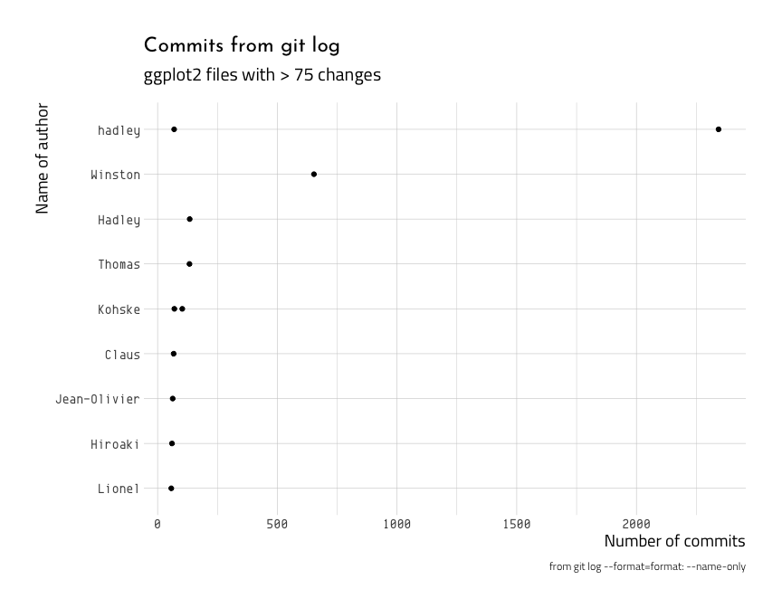
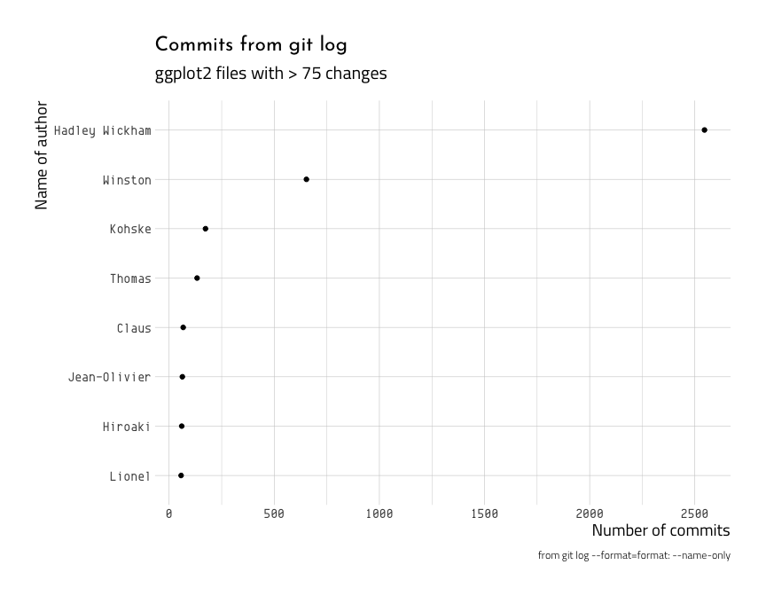

Git log data - author info
================

Check out the repository for this project [here]().

## The git log

We can use `git log --graph` to see a plain text representation of the
file changes. The asterisk (`*`) shows which branch the commit was on,
so the graph below tells us that the `8f27d7a8` and `82297c05` commits
are on a topic branch and the rest are on the `master` branch.

``` bash
# change dir
cd downloads/ggplot2 
# check the git log with the -L option
git log --graph --oneline --decorate | head -n 75
```

    #>  * 5a686c34 (HEAD -> master, origin/master, origin/HEAD) Fix typo, missing a backtick in an error message (#3724)
    #>  * 01830119 Type stability for scale_apply() (#3711, closes #3688)
    #>  * 3e3abd99 Fix a typo (#3719)
    #>  * 1d3a4ac5 Fix typos in examples (#3714)
    #>  * 6f93aa06 Increment version number
    #>  * cf930a56 bump version
    #>  * 05220f08 Fix a typo in NEWS.md (#3709)
    #>  * 94b5a16c Fix ScaleBinnedPosition for new axis implementation (#3694)
    #>  * 9fdf452d Clean up strip rendering code (#3683)
    #>  * a56abd37 typos in NEWS.md (#3692)
    #>  * c514c261 Fix limits argument of scale_{colour,fill}_manual() (#3685)
    #>  * a8acd82e Enable geom_ribbon() to draw separate lines for upper and lower intervals (#3529)
    #>  * 56294a75 Change CURVE-like sf types to "line" (#3682)
    #>  * 119c9c84 Improved docs for register_theme_elements() (#3691)
    #>  * dd0483bb Remove stops.rds. Closes #3689. (#3690)
    #>  * 47a06183 Add function for registering of new theme elements. (#3678)
    #>  * d05e437e Use EPSG code instead of proj4string "+init=epsg:XXXX" (#3687)
    #>  * e6cbcc1b Fix #3498 Restore data order after collide (#3680)
    #>  * 351eb416 Allow rlang-style lambda expressions in stat_summary functions (#3569)
    #>  * 660aad2d Move error signalling to rlang::abort() (#3526)
    #>  * ee3cf495 Don't switch relationship of ymin/ymax during stacking (#3673)
    #>  * 9f0fc2dc Fix #3539 Make sure tiles that runs outside the scale limits are removed (#3547)
    #>  * fc600512 Finer control over aesthetic evaluation (#3534)
    #>  * 5d1d773c Add value matching to breaks in manual_scale (#3579)
    #>  * 98c49fe5 Eliminate reshape dependency (#3639)
    #>  * bd1bffd3 Use HTTPS for CRAN badge (#3632)
    #>  * e076d9b5 Better handle position aesthetics in params (#3666)
    #>  * 010bffc4 Add trans field to ScaleContinuous (#3664)
    #>  * b122e2ae Make sure flip is never NA (#3665)
    #>  * 0315dc3b Fix theme inheritance when not inheriting from blank (#3663)
    #>  * 70a094e4 address duplicate aesthetic listings in documentation, re #3618 (#3657)
    #>  * 48660e13 Enable geom_sf to automatically determine the legend type (#3646)
    #>  * 16ed4d00 refactor show.legend code (#3652)
    #>  * 913e936c README Typo, Capitalization Changes (#3645)
    #>  * 64248088 Correct a spelling mistake in the documatation of continuous_scale (#3643)
    #>  * b480de80 Direct link to function docu, not package docu (#3641)
    #>  * 5dfe4982 Upgrade to roxygen2 7.0.1 (#3637)
    #>  * 9ec8feef Update visual cases (#3638)
    #>  * cb0eaa0e Typo fix: Remove double "just" in documentation (#3628)
    #>  * 2bc493e2 Remove viridisLite (#3631)
    #>  * f418e92b Enable user-defined theme elements by making element tree part of the theme. (#2784)
    #>  * f0ce2851 Explicitly define all theme elements (#3585)
    #>  * 86cc4d27 Fix scale- and coord-related regressions (#3566)
    #>  * 5e388e14 Implement n_breaks in continuous_scale (#3102)
    #>  * 0c997f17 Fix #3575 fix a bug in ScaleBinned$get_breaks() (#3575)
    #>  * 5f7d6965 Fix #3590 Add `orientation` argument to geom_ribbon doc as it is ambiguous (#3605)
    #>  *   e58be030 Add `LICENSE.md`
    #>  |\  
    #>  | * 0d46668b Add LICENSE.md
    #>  |/  
    #>  * 48580251 fixes #3606 (#3613)
    #>  * ebf88caf Alpha affects line geom_sf() (#3608)
    #>  * 3870c12e Fix guide merging when there are repeated labels (#3599, fixes #3573)
    #>  * bad6f380 Fix guide_bins() when the data has no size (#3593)
    #>  * 40e8b609 Handle NA gracefully in geom_sf (#3546)
    #>  * 528a3740 add Dewey Dunnington to package authors (#3603, closes #3588)
    #>  * fb731913 Improved error messages for plot addition. (#3600)
    #>  * 6efb0d30 move isoband from Suggests to Imports (#3598, fixes #3564)
    #>  * 36b50fe2 Handle a quosure properly. Closes #3552 (#3597)
    #>  * f846d11f Add missing verb (#3562)
    #>  * 5188f5e0 better error message when trying to add a function to a plot. Closes #3571. (#3594)
    #>  * a1143e1e forgot to update namespace (#3595)
    #>  * 6f5ffea7 Clean up theme addition (#3570)
    #>  * 115c3960 Increase the default nbin of colourbar (#3521)
    #>  * f16f16fb enable inheritance for derived theme elements; closes #3549 (#3550)
    #>  * 9b667b94 Various fixes to orientation sniffing (#3553)
    #>  * a2ab1976 Use na.rm parameter in StatBoxplot (#3556)
    #>  * 18958642 Fix remove_missing() call in Stat$compute_layer() so that bidirectional layers work (#3555)
    #>  * 94d18b84 Use new function argument names for stat_summary in tests (#3554)
    #>  * 10fa0014 Removing direction constraint from geoms (#3506)
    #>  * 88c5bde5 Minor updates to data docs (#3545)
    #>  * 9a45cc89 scale_binned (#3096)
    #>  * 0ee259cc default formula argument to NULL in geom_smooth() (#3307)
    #>  * fa000f78 Make position guides customizable (#3398, closes #3322)
    #>  * 23e32419 Clarify documentation in mpg: very minor (#3515)

### Narrowing the dates of the `git log`

We can use `--before` and `--after` or `--since="YYYY-M-D"` and
`--until="YYYY-MM-DD"` to specify the range of dates in the `git log`.
This comes in handy if we want to limit the scope of the log results. To
display all the commits added between December 1st, 2017 and January
15th, 2017, you would use the following:

``` bash
# change dir
cd downloads/ggplot2 
# test after 2016
git log --after="2016-12-1" --before="2017-1-15" --format=format: --name-only --oneline | egrep -v '^$' | sort | uniq -c | sort -r | head -n 10
# git log --format=format: --name-only --after=12.31.2016 | egrep -v '^$' | sort | uniq -c | sort -r | head -n 10
```

    #>     2 NEWS.md
    #>     2 DESCRIPTION
    #>     1 vignettes/releases/ggplot2-2.2.0.Rmd
    #>     1 man/zeroGrob.Rd
    #>     1 man/wrap_dims.Rd
    #>     1 man/waiver.Rd
    #>     1 man/update_labels.Rd
    #>     1 man/update_defaults.Rd
    #>     1 man/txhousing.Rd
    #>     1 man/translate_qplot_lattice.Rd

### Word count (`wc`)

We can also use a range of commits using either `--since` or `--until`.
For example, we might only want to know how many changes were made to
`ggplot2` for one month after publication of the R for Data Science book
(in 2017).

``` bash
# change dir
cd downloads/ggplot2 
# since 2017-2018
git log --since="2017-1-1" --until="2017-12-31" | grep 'commit' | wc -l
```

    #>       216

Or the `--after` and `--before`

``` bash
# change dir
cd downloads/ggplot2 
# since 2017-2018
git log --after="2017-1-1" --before="2017-12-31" | grep 'commit' | wc -l
```

    #>       216

We are going to start with some basic `git log` options.

## Calculate hotspots by level of logical components

The `--rev-list` is considered a plumber command, and is used to return
a set of commits bounded by some range or criteria. The Software X-rays
book defines this in the following sentence,

> Use `git rev-list --count HEAD` to aggregate all contributions and
> calculate hotspots on the level of logical components.

The syntax above is how we can count the number of the contributions
(file changes) in particular files. Consider the layout od the following
folder.

``` r
fs::dir_tree("downloads/ggplot2", recurse = FALSE)
```

    #>  downloads/ggplot2
    #>  ├── CODE_OF_CONDUCT.md
    #>  ├── CONTRIBUTING.md
    #>  ├── DESCRIPTION
    #>  ├── GOVERNANCE.md
    #>  ├── ISSUE_TEMPLATE.md
    #>  ├── LICENSE
    #>  ├── LICENSE.md
    #>  ├── NAMESPACE
    #>  ├── NEWS
    #>  ├── NEWS.md
    #>  ├── R
    #>  ├── README.Rmd
    #>  ├── README.md
    #>  ├── _pkgdown.yml
    #>  ├── appveyor.yml
    #>  ├── codecov.yml
    #>  ├── cran-comments.md
    #>  ├── data
    #>  ├── data-raw
    #>  ├── ggplot2.Rproj
    #>  ├── icons
    #>  ├── inst
    #>  ├── man
    #>  ├── pkgdown
    #>  ├── revdep
    #>  ├── tests
    #>  └── vignettes

## The revision list (`git rev-list` for contributions)

According to Tornhill,

`git rev-list --count HEAD` will *aggregate all contributions and
calculate hotspots on the level of logical components.*

The language parsers might be the reason for running into some
limitation in the `ggplot2` package. Below is the contribution from the
2016 text, Professional Git,

> *Notice the \<`rev-list options`\> in the last line on the command
> line in the previous section. Git `rev-list` is another plumbing
> command. Its main use is to list a set of commits bounded by some
> range or criteria. It’s pretty straightforward to use, so I’ll just
> share the syntax here. You can use the `rev-list` help page to find
> out more details on specifying ranges if you’re interested.*

### Count the changes to files within a folder

If we want to see the relative contributions to each project we can use
the following command to narrow the file changes to the `man` folder.

``` bash
# change dir
cd downloads/ggplot2 
# get rev-list data-raw
git rev-list --count HEAD -- man
```

    #>  1092

The output above is telling us the number of file changes in the `man`
folder. But we can extend this command to a particular *file* within a
specified folder. For example, compare the number of changes to the `R`
folder to the number of changes to the `layer.r` file in the `R` folder
(shown below):

``` bash
# change dir
cd downloads/ggplot2 
# get rev-list R
git rev-list --count HEAD -- R/layer.r
```

    #>  231

And, as expected, this number is way less (`227`), than the `R` folders
(`3310`) shown below. On Github, we can read up on the [How it
works](https://github.com/AlDanial/cloc#how-it-works-) section from the
repo. I’ve created a PDF for this too (find it in the `meta` portion of
this repo).

``` bash
# change dir
cd downloads/ggplot2 
# get rev-list R
git rev-list --count HEAD -- R
```

    #>  3367

This could be used to show what files make up the majority of the
changes within a folder (i.e. how many of the total changes in this
folder are this particular file?).

## Historic revisions based on a function or lines of code

The `git log -L` is what we will use to get more details on the changes
to the actual lines of code. From the `SDX` text,

> *In that case you specify the `-L` option, which instructs Git to
> fetch each historic revision based on the range of lines of code that
> make up a function. Here’s an example on Linux to X-Ray the
> `intel_crtc_page_flip` function in the
> `drivers/gpu/drm/i915/intel_display.c` hotspot:*

Recall that `git log` gives the,

> *the complete state of the code as it looked in each revision. This
> comes in handy if you want to calculate complexity trends.*

So, this is parsing a `.c` file, but we can attempt to replicate this on
one of `.R` files. In order to get all the available statistics, we
might need to find a repo with a language that `cloc` documents. I know
`cloc` won’t count the `.Rd` files, but that’s not a deal sealer…

### `git log -L` based on specific file

The `git log -L` syntax follows the following structure for getting the
log on a particular file.

  - `git log -L:` :`function`:`path/to/file/with/function.R`

Let’s use the `R/layer.r` file, and the `function` function. We’re going
to assume here that the general form of the following code,

  - `git log
    -L:intel_crtc_page_flip:drivers/gpu/drm/i915/intel_display.c`

Can be re-written using:

  - `git log -L:layer:R/layer.r`

We’re going to be looking for `layer` (because this is the function the
file defines), and we will see how many changes this function had over
the course of the project. We’ll test this with the top (`head -n 50`)
of the commit log:

``` bash
# change dir
cd downloads/ggplot2 
# get head 
git log -L:layer:R/layer.r | head -n 50
```

    #>  commit 660aad2db2b3495ae0d8040915a40d247133ffc0
    #>  Author: Thomas Lin Pedersen <thomasp85@gmail.com>
    #>  Date:   Tue Dec 17 20:37:28 2019 +0100
    #>  
    #>      Move error signalling to rlang::abort() (#3526)
    #>  
    #>  diff --git a/R/layer.r b/R/layer.r
    #>  --- a/R/layer.r
    #>  +++ b/R/layer.r
    #>  @@ -64,93 +64,84 @@
    #>   layer <- function(geom = NULL, stat = NULL,
    #>                     data = NULL, mapping = NULL,
    #>                     position = NULL, params = list(),
    #>                     inherit.aes = TRUE, check.aes = TRUE, check.param = TRUE,
    #>                     show.legend = NA, key_glyph = NULL, layer_class = Layer) {
    #>     if (is.null(geom))
    #>  -    stop("Attempted to create layer with no geom.", call. = FALSE)
    #>  +    abort("Attempted to create layer with no geom.")
    #>     if (is.null(stat))
    #>  -    stop("Attempted to create layer with no stat.", call. = FALSE)
    #>  +    abort("Attempted to create layer with no stat.")
    #>     if (is.null(position))
    #>  -    stop("Attempted to create layer with no position.", call. = FALSE)
    #>  +    abort("Attempted to create layer with no position.")
    #>   
    #>     # Handle show_guide/show.legend
    #>     if (!is.null(params$show_guide)) {
    #>  -    warning("`show_guide` has been deprecated. Please use `show.legend` instead.",
    #>  -      call. = FALSE)
    #>  +    warn("`show_guide` has been deprecated. Please use `show.legend` instead.")
    #>       show.legend <- params$show_guide
    #>       params$show_guide <- NULL
    #>     }
    #>   
    #>     # we validate mapping before data because in geoms and stats
    #>     # the mapping is listed before the data argument; this causes
    #>     # less confusing error messages when layers are accidentally
    #>     # piped into each other
    #>     if (!is.null(mapping)) {
    #>       mapping <- validate_mapping(mapping)
    #>     }
    #>   
    #>     data <- fortify(data)
    #>   
    #>     geom <- check_subclass(geom, "Geom", env = parent.frame())
    #>     stat <- check_subclass(stat, "Stat", env = parent.frame())
    #>     position <- check_subclass(position, "Position", env = parent.frame())
    #>   
    #>     # Special case for na.rm parameter needed by all layers
    #>     if (is.null(params$na.rm)) {

Here we can see a change from Claus Wilke in August of 2019, the `git
commit` message is at the top of the output. Let’s compare this to the
bottom of `git log -L` results,

``` bash
# change dir
cd downloads/ggplot2 
# get tail
git log -L:layer:R/layer.r | tail -n 63
```

    #>  commit fbbe61f6c37f85b2e22f73b12300f683c73ad98f
    #>  Author: hadley <h.wickham@gmail.com>
    #>  Date:   Wed Aug 26 11:06:52 2015 -0500
    #>  
    #>      Minor style and doc tweaks
    #>  
    #>  diff --git a/R/layer.r b/R/layer.r
    #>  --- a/R/layer.r
    #>  +++ b/R/layer.r
    #>  @@ -0,0 +21,53 @@
    #>  +layer <- function(geom = NULL, geom_params = list(), stat = NULL,
    #>  +  stat_params = list(), data = NULL, mapping = NULL,
    #>  +  position = NULL, params = list(), inherit.aes = TRUE,
    #>  +  subset = NULL, show.legend = NA) {
    #>  +  if (is.null(geom))
    #>  +    stop("Attempted to create layer with no geom.", call. = FALSE)
    #>  +  if (is.null(stat))
    #>  +    stop("Attempted to create layer with no stat.", call. = FALSE)
    #>  +  if (is.null(position))
    #>  +    stop("Attempted to create layer with no position.", call. = FALSE)
    #>  +
    #>  +  # Handle show_guide/show.legend
    #>  +  if (!is.null(params$show_guide)) {
    #>  +    warning("`show_guide` has been deprecated. Please use `show.legend` instead.",
    #>  +      call. = FALSE)
    #>  +    show.legend <- params$show_guide
    #>  +    params$show_guide <- NULL
    #>  +  }
    #>  +  if (!is.logical(show.legend) || length(show.legend) != 1) {
    #>  +    warning("`show.legend` must be a logical vector of length 1.", call. = FALSE)
    #>  +    show.legend <- FALSE
    #>  +  }
    #>  +
    #>  +  data <- fortify(data)
    #>  +  if (!is.null(mapping) && !inherits(mapping, "uneval")) {
    #>  +    stop("Mapping must be created by `aes()` or `aes_()`", call. = FALSE)
    #>  +  }
    #>  +
    #>  +  if (is.character(geom)) geom <- make_geom(geom)
    #>  +  if (is.character(stat)) stat <- make_stat(stat)
    #>  +  if (is.character(position)) position <- make_position(position)
    #>  +
    #>  +  # Categorize items from params into geom_params and stat_params
    #>  +  if (length(params) > 0) {
    #>  +    geom_params <- utils::modifyList(params, geom_params)
    #>  +    stat_params <- utils::modifyList(params, stat_params)
    #>  +  }
    #>  +  geom_params <- rename_aes(geom_params)
    #>  +
    #>  +  ggproto("LayerInstance", Layer,
    #>  +    geom = geom,
    #>  +    geom_params = geom_params,
    #>  +    stat = stat,
    #>  +    stat_params = stat_params,
    #>  +    data = data,
    #>  +    mapping = mapping,
    #>  +    subset = subset,
    #>  +    position = position,
    #>  +    inherit.aes = inherit.aes,
    #>  +    show.legend = show.legend
    #>  +  )
    #>  +}
    #>  +

Here we can see a change from Hadley from January of 2015, and a git
commit message: `Minor style and doc tweaks.` Some important things to
remember about these commands is that **they will produce a lot of
output (it’s all changes to each file)**, especially to files that have
seen lots of revisions.

We can see why `layer.r` would be considered a hotspot, and it’s because
it has had many changes, and these changes are large in nature.

> "The command outputs the complete state of the code as it looked in
> each revision. This comes in handy if you want to calculate complexity
> trends

### `git log -L` changes by line number

So `git log -L` option also gives us the total changes for a set of
lines (indicated with line numbers), or by specifying a function (by
name) within a particular file (indicated by path).

``` bash
git log -L <start line number>,<end line number>:<file name>
```

## Tech debt interest rate (the change frequency of the hotspot)

The hotspots and commits can be used to calculate the *technical debt
interest rate*,

> If you just want to get a proxy for the technical debt interest rate,
> then you can count the change frequency of the hotspot function by
> means of commandline tools. Here’s an example from a Bash shell where
> `grep` filters out each commit hash, `wc -l` counts them, and the
> `--after` option limits the amount of data to a recent development
> period:

### Word counts

So if we want to check the technical debt of *a particular function
within a particular file (gauged by it’s change frequency)*, we can use
the following commands to see how many changes have been made to the
`layer` function in the `layer.r` file.

``` bash
# change dir
cd downloads/ggplot2 
# since the beginning of time
git log -L:layer:R/layer.r | grep 'commit ' | wc -l 
```

    #>        22

If we are adjusting for date, we can get a range of dates with
`--after="2017-1-1"` and `--before="2017-12-31"`.

``` bash
# change dir
cd downloads/ggplot2 
# between 2015-01-01 and 2019-09-02
git log -L:layer:R/layer.r --after="2015-1-1" --before="2019-9-2" | grep 'commit' | wc -l
# between 2015-01-01 and 2019-09-03
git log -L:layer:R/layer.r --after="2015-1-1" --before="2019-9-3" | grep 'commit' | wc -l
```

    #>         0
    #>         0

These are counting up as `0`

``` bash
# change dir
cd downloads/ggplot2 
# check after
git log -L:layer:R/layer.r --after="2016-01-01" | grep 'commit' | wc -l 
# check before 
git log -L:layer:R/layer.r --before="2019-01-01" | grep 'commit' | wc -l 
# check since 
git log -L:layer:R/layer.r --since="2015-1-1" | grep 'commit' | wc -l 
# check until
git log -L:layer:R/layer.r --until="2018-8-16" | grep 'commit' | wc -l 
```

    #>        17
    #>         0
    #>        22
    #>         0

This shows a relatively low number of changes to `layer` in the
`layer.R` over time, but it depends on the date (which is in a strange
format).

## Author Summaries with `git shortlog -s`

Author summaries are extracted using the `git shortlog`. This is a
commmand that lists who the authors were for each commit. Below is an
example of running this command in the `ggplot2` folder.

``` bash
# change dir
cd downloads/ggplot2
# check shortlog (summary, unique, sorted, and only return 12)
git shortlog -s | uniq -c | sort -r | head -n 12
```

For some reason, this wouldn’t run in RStudio, but it will run in the
Terminal window (see below).

``` bash
   1   2343     hadley
   1    653     Winston Chang
   1    134     Hadley Wickham
   1    133     Thomas Lin Pedersen
   1    103     Kohske Takahashi @ jurina
   1     70     Kohske Takahashi at Haruna
   1     69     hadley wickham
   1     67     Claus Wilke
   1     63     Jean-Olivier Irisson
   1     60     Hiroaki Yutani
   1     57     Lionel Henry
   1     50     Dewey Dunnington
# omitted...
```

Let’s create a new file and save the author summaries so they can be
read into RStudio.

``` bash
# change dir
cd downloads/ggplot2
# create files
touch "author_summary.txt" 
# ls
git shortlog -s | uniq -c | sort -r >> author_summary.txt
```

This will show you the message, `(reading log message from standard
input)` and it will take a bit for this to quit running. But when it is
done, we can read this file into RStudio.

``` r
fs::file_move(path = "downloads/ggplot2/author_summary.txt", 
              # move to this 
              new_path = paste0("data/", 
                                base::noquote(lubridate::today()), 
                                "-author_summary.txt"))
```

Now we check the location of the new `-author_summary.txt`

``` r
fs::dir_tree("data", recurse = FALSE)
```

    #>  data
    #>  ├── 2020-01-15-GitFileCount.csv
    #>  ├── 2020-01-15-author_summary.txt
    #>  ├── 2020-01-15-file_name_counts.txt
    #>  ├── 2020-02-10-AuthSummShortlog.csv
    #>  ├── 2020-02-10-GitFileCount.csv
    #>  ├── 2020-02-10-file_name_counts.txt
    #>  └── README.md

We can create the author summary file as a text vector.

``` r
tday_date <- as.character(lubridate::today())
author_summary_file <- paste0("data/", 
                              tday_date,
                              "-author_summary.txt")
author_summary_file
```

    #>  [1] "data/2020-02-10-author_summary.txt"

``` r
# fs::dir_ls("data", recurse = FALSE)
AuthSummShortlogRaw <- readr::read_table2(file = "data/2020-01-15-author_summary.txt",
                                              col_names = c("no",
                                                    "commit_count",
                                                    "commit_author"))
```

    #>  Parsed with column specification:
    #>  cols(
    #>    no = col_double(),
    #>    commit_count = col_double(),
    #>    commit_author = col_character()
    #>  )

Inspect the raw data

``` r
AuthSummShortlogRaw %>% glimpse(78)
```

    #>  Observations: 241
    #>  Variables: 3
    #>  $ no            <dbl> 1, 1, 1, 1, 1, 1, 1, 1, 1, 1, 1, 1, 1, 1, 1, 1, 1, 1,…
    #>  $ commit_count  <dbl> 2343, 653, 134, 133, 103, 70, 69, 67, 63, 60, 57, 50,…
    #>  $ commit_author <chr> "hadley", "Winston", "Hadley", "Thomas", "Kohske", "K…

``` r
# remove first column
AuthSummShortlog <- dplyr::select(AuthSummShortlogRaw, -c("no"))
# create factor 
AuthSummShortlog <- AuthSummShortlog %>% 
  dplyr::mutate(
  commit_author = base::factor(commit_author))
AuthSummShortlog %>% skimr::skim()
```

|                                                  |            |
| :----------------------------------------------- | :--------- |
| Name                                             | Piped data |
| Number of rows                                   | 241        |
| Number of columns                                | 2          |
| \_\_\_\_\_\_\_\_\_\_\_\_\_\_\_\_\_\_\_\_\_\_\_   |            |
| Column type frequency:                           |            |
| factor                                           | 1          |
| numeric                                          | 1          |
| \_\_\_\_\_\_\_\_\_\_\_\_\_\_\_\_\_\_\_\_\_\_\_\_ |            |
| Group variables                                  | None       |

Data summary

**Variable type: factor**

| skim\_variable | n\_missing | complete\_rate | ordered | n\_unique |          top\_counts           |
| :------------- | ---------: | -------------: | :------ | --------: | :----------------------------: |
| commit\_author |          0 |              1 | FALSE   |       200 | Koh: 5, Dan: 4, Dav: 4, Tho: 4 |

**Variable type: numeric**

| skim\_variable | n\_missing | complete\_rate |  mean |  sd | p0 | p25 | p50 | p75 | p100 | hist  |
| :------------- | ---------: | -------------: | ----: | --: | -: | --: | --: | --: | ---: | :---- |
| commit\_count  |          0 |              1 | 18.58 | 157 |  1 |   1 |   1 |   3 | 2343 | ▇▁▁▁▁ |

### How many authors are in this repo?

``` r
AuthSummShortlog %>% 
  distinct(commit_author) %>% 
  base::nrow()
```

    #>  [1] 200

This means there are 200 authors in the author summary file.

# Visualize file changes

Below we set a theme and check the number of changes by author.

``` r
ggplot2::theme_set(hrbrthemes::theme_ipsum_tw(
  base_size = 11,
  strip_text_size = 12,
  axis_title_size = 14,
  plot_title_size = 17,
  subtitle_size = 15,
  base_family = "EnvyCodeR",
  # "JosefinSans-LightItalic"
  strip_text_family = "TitilliumWeb-Regular",
  axis_title_family = "TitilliumWeb-Regular",
  subtitle_family = "TitilliumWeb-Regular",
  plot_title_family = "JosefinSans-Regular"
))
```

Below I can plot the number of commits against the name of the author
who made the changes.

``` r
# define labs first!
commit_count_labs <- ggplot2::labs(
    y = "Number of commits",
    x = "Name of author",
    title = "Commits from git log",
    subtitle = "ggplot2 files with > 75 changes",
    caption = "from git log --format=format: --name-only") 
AuthSummShortlog %>% 
  dplyr::filter(commit_count > 50) %>%  
  ggplot2::ggplot(aes(x = forcats::fct_reorder(.f = commit_author,
                             .x = commit_count),
             y = commit_count)) +
  ggplot2::geom_point() + 
  ggplot2::coord_flip() +
  commit_count_labs
```

<!-- -->

This shows one possible shortcoming, Hadley is listed in here twice
(`Hadley` and `hadley`). We can follow the advice
[here](https://simonharrer.wordpress.com/tag/git-shortlog/) or we can
handle the issue with authors using different aliases (`Hadley` vs
`hadley`) with a little wrangling.

``` r
AuthSummShortlog %>% 
  dplyr::filter(commit_count > 50) %>% 
  dplyr::mutate(author = case_when(
    # find all Hadley names
    stringr::str_detect(string = commit_author, 
                                  pattern = "hadley|Hadley") ~ "Hadley Wickham",
    TRUE ~ as.character(commit_author)),
    # convert to factor
                author = as.factor(author)) %>% 
  # arrange descending 
  dplyr::arrange(desc(author)) %>% 
  # group by author
  dplyr::group_by(author) %>% 
  # sum the author commits
  dplyr::summarize(commit_count = sum(commit_count, na.rm = TRUE)) %>% 
  # reorder these by the count
  ggplot2::ggplot(aes(x = forcats::fct_reorder(.f = author,
                    .x = commit_count),
             y = commit_count)) +
  ggplot2::geom_point() + 
  ggplot2::coord_flip() + 
  commit_count_labs
```

<!-- -->

Now we can export these data for future use.

``` r
readr::write_csv(as.data.frame(AuthSummShortlog), 
                 path = paste0("data/", 
                         base::noquote(lubridate::today()), 
                           "-AuthSummShortlog.csv"))
fs::dir_tree("data", regex = "-AuthSummShortlog.csv")
```

    #>  data
    #>  └── 2020-02-10-AuthSummShortlog.csv
