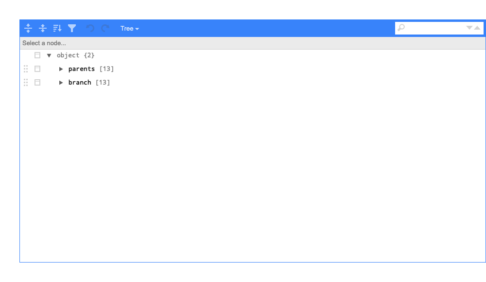
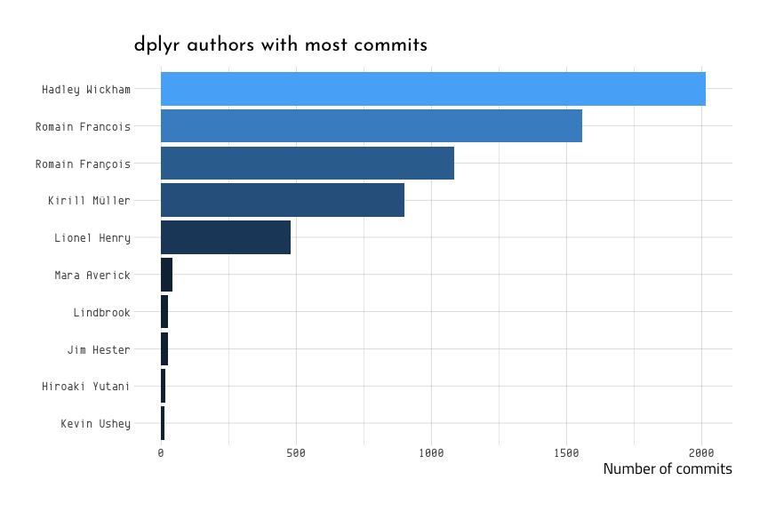
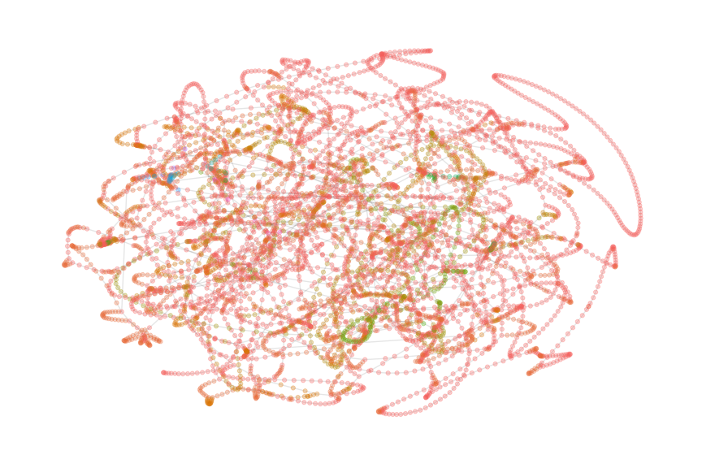

Aperture - Reproduce Simon Jackosn’s Tidy Git analysis
================

# Resources for analyzing code

There are quite a few blogs and resources for analyzing Github data.
This document is the first of two blog posts for analyzing Github data.

1.  [Guide to tidy git
    analysis](https://drsimonj.svbtle.com/embarking-on-a-tidy-git-analysis):
    this is a blog post that looks into the `dplyr` repository, but
    minimally.

2.  Jenny Bryan from RStudio has an excellent repository for exploring
    Github data here: [“Examples of using `purrr` with gh to do things
    in bulk via GitHub
    API”](https://github.com/jennybc/purrr-gh-github-api-fun).

First we load the `packages`.

``` r
# Parts 1 and 2
library(tidyverse)
library(glue)
library(stringr)
library(forcats)

# Part 3
library(tidygraph)
library(ggraph)
library(tidytext)
```

The next few steps outlines putting a Github repo (essentially a url)
into a text vector, then use this to clone the repo into a temporary
directory (`temp`).

``` r
# Remote repository URL
repo_url <- "https://github.com/tidyverse/dplyr.git"
# Directory into which git repo will be cloned
clone_dir <- file.path(tempdir(), "git_repo")
clone_dir
```

    #>  [1] "/var/folders/fl/kv1bdvrx04524bnvdzhfx3p80000gn/T//RtmpVeKiEd/git_repo"

``` r
# Create command
clone_cmd <- glue::glue("git clone {repo_url} {clone_dir}")
clone_cmd
```

    #>  git clone https://github.com/tidyverse/dplyr.git /var/folders/fl/kv1bdvrx04524bnvdzhfx3p80000gn/T//RtmpVeKiEd/git_repo

``` r
# Invoke command
# system(clone_cmd)
```

## `glue` stuff together

Next we end up `glue`ing the commands together into a text string
(`clone_cmd`). Finally we call it using the `system()` command.

Fortunately, we already have the `git` information and the repo
downloaded in another folder.

``` r
fs::dir_tree(".", recurse = FALSE)
```

    #>  .
    #>  ├── 01.0-git-file-changes-R.Rmd
    #>  ├── 01.0-git-file-changes-R.md
    #>  ├── 02.0-git-author-data-R.Rmd
    #>  ├── 02.0-git-author-data-R.md
    #>  ├── 03.1-tidy-git-analysis-jackson.Rmd
    #>  ├── 03.2-gh-purrr-package-byran.Rmd
    #>  ├── CHANGELOG.md
    #>  ├── CITATION
    #>  ├── EXAMPLES.md
    #>  ├── LICENSE
    #>  ├── README.Rmd
    #>  ├── README.md
    #>  ├── code
    #>  ├── data
    #>  ├── doc
    #>  ├── docs
    #>  ├── downloads
    #>  ├── figs
    #>  ├── git-logs.Rproj
    #>  ├── helpers.md
    #>  ├── requirements.txt
    #>  └── results

So we can rename `clone_dir` to `downloads/dplyr`.

``` r
clone_dir <- file.path("downloads", "dplyr")
clone_dir
```

    #>  [1] "downloads/dplyr"

Then create a new set of commands which will clone the
`tidyverse/dplyr.git` repo into `downloads/dplyr`

``` r
# Create command
clone_cmd <- glue::glue("git clone {repo_url} {clone_dir}")
clone_cmd
```

    #>  git clone https://github.com/tidyverse/dplyr.git downloads/dplyr

And execute the command using `system()`.

In order to get the history from the gitlog, we’ll need to combine the
`git` commands with the `glue` and `system` commands.

``` r
# Invoke command
system(clone_cmd)
```

``` r
fs::dir_tree("downloads/dplyr", recurse = FALSE)
```

    #>  downloads/dplyr
    #>  ├── DESCRIPTION
    #>  ├── Doxyfile
    #>  ├── LICENSE
    #>  ├── LICENSE.md
    #>  ├── NAMESPACE
    #>  ├── NEWS.md
    #>  ├── R
    #>  ├── README.Rmd
    #>  ├── README.md
    #>  ├── _pkgdown.yml
    #>  ├── archive
    #>  ├── codecov.yml
    #>  ├── cran-comments.md
    #>  ├── data
    #>  ├── data-raw
    #>  ├── dplyr.Rproj
    #>  ├── inst
    #>  ├── man
    #>  ├── pkgdown
    #>  ├── revdep
    #>  ├── src
    #>  ├── tests
    #>  └── vignettes

### The tidy git history

We can use `glue` again to get the git log.

``` r
system(glue('git -C {clone_dir} log -3'))
```

The next few options clean up a git lot command so that we can include
some options to clean up the output.

``` r
log_format_options <- c(datetime = "cd", 
                        commit = "h", 
                        parents = "p", 
                        author = "an", 
                        subject = "s")
log_format_options
```

    #>  datetime   commit  parents   author  subject 
    #>      "cd"      "h"      "p"     "an"      "s"

``` r
option_delim <- "\t"
log_format <- glue("%{log_format_options}") %>% collapse(option_delim)
log_format
```

    #>  %cd %h  %p  %an %s

``` r
log_options  <- glue('--pretty=format:"{log_format}" --date=format:"%Y-%m-%d %H:%M:%S"')
log_options
```

    #>  --pretty=format:"%cd    %h  %p  %an %s" --date=format:"%Y-%m-%d %H:%M:%S"

``` r
log_cmd <- glue('git -C {clone_dir} log {log_options}')
log_cmd
```

    #>  git -C downloads/dplyr log --pretty=format:"%cd %h  %p  %an %s" --date=format:"%Y-%m-%d %H:%M:%S"

Now, this looks more like a git log command.

``` r
log_cmd
```

    #>  git -C downloads/dplyr log --pretty=format:"%cd %h  %p  %an %s" --date=format:"%Y-%m-%d %H:%M:%S"

Now we can take `log_cmd` and pass it to `system(glue('{log_cmd} -3'))`.

``` r
system(glue('{log_cmd} -3'))
```

And here we have a tidy-ish output. In order to get this into a tidy
data frame, we’ll need some help from `stringr` and `tibble`.

``` r
HistLogs <- base::system(command = log_cmd, 
                         intern = TRUE) %>% 
  # convert this to a tibble
  tibble::as_tibble() %>% 
  # split the value into necessary components
  tidyr::separate(data = ., 
                  col = value, 
                  into = c("datetime", "commit", 
                           "parents", "author", 
                           "subject"), sep = "\t") %>% 
  # split the date into date and time
  tidyr::separate(data = .,
                  col = datetime,
                  into = c("date", "time"),
                  sep = " ",
                  remove = FALSE) %>%
  # convert datetime to POSIXct
  dplyr::mutate(date = lubridate::ymd_hms(datetime, tz = "UTC"),
                # put parents in a list column
                parents = stringr::str_split(string = parents, 
                                             pattern = " "))
HistLogs %>% head(10)
```

    #>  # A tibble: 10 x 7
    #>     datetime   date                time   commit parents author  subject       
    #>     <chr>      <dttm>              <chr>  <chr>  <list>  <chr>   <chr>         
    #>   1 2020-01-1… 2020-01-16 17:49:20 17:49… 057b4… <chr [… Romain… Fix cur_group…
    #>   2 2020-01-1… 2020-01-16 05:46:21 05:46… 2cfdf… <chr [… Hadley… News tweaking 
    #>   3 2020-01-1… 2020-01-16 05:46:21 05:46… b7c5e… <chr [… Hadley… Document slic…
    #>   4 2020-01-1… 2020-01-16 05:46:21 05:46… ccb52… <chr [… Hadley… Improve secti…
    #>   5 2020-01-1… 2020-01-16 05:46:21 05:46… 80ae4… <chr [… Hadley… Simplify pkgc…
    #>   6 2020-01-1… 2020-01-16 05:46:21 05:46… bdfd0… <chr [… Hadley… Document join…
    #>   7 2020-01-1… 2020-01-15 21:37:53 21:37… 3fa41… <chr [… Romain… reduce redund…
    #>   8 2020-01-1… 2020-01-15 17:45:13 17:45… c58f9… <chr [… Romain… bullet errors…
    #>   9 2020-01-1… 2020-01-15 10:15:49 10:15… 6daea… <chr [… Hadley… Better docume…
    #>  10 2020-01-1… 2020-01-15 10:15:36 10:15… 2de25… <chr [… Hadley… Merge remote-…

``` r
# Start with NA
HistLogs <- HistLogs %>% 
    dplyr::mutate(branch = NA_integer_)
```

``` r
# Create a boolean vector to represent free columns (1000 should be plenty!)
free_col <- rep(TRUE, 1000)
free_col %>% head()
```

    #>  [1] TRUE TRUE TRUE TRUE TRUE TRUE

Now we introduce the `for` loop that creates a parent file

``` r
for (i in seq_len(nrow(HistLogs) - 1)) { # - 1 to ignore root
  
  # Check current branch col and assign open col if NA
  
  branch <- HistLogs$branch[i]

  if (is.na(branch)) {
    branch <- which.max(x = free_col)
    free_col[branch] <- FALSE
    HistLogs$branch[i] <- branch
  }

  # Go through parents
  parents <- HistLogs$parents[[i]]

  for (p in parents) {
    
    parent_col <- HistLogs$branch[HistLogs$commit == p]

    # If col is missing, assign it to same branch (if first parent) or new
    # branch (if other)
    
    if (is.na(parent_col)) {
      parent_col <- dplyr::if_else(condition = p == parents[1], 
                            true = branch, 
                            false = which.max(free_col))

    # If NOT missing this means a split has occurred. Assign parent the lowest
    # and re-open both cols (parent closed at the end)
    
    } else {
      free_col[c(branch, parent_col)] <- TRUE
      parent_col <- min(branch, parent_col)

    }

    # Close parent col and assign
    
    free_col[parent_col] <- FALSE
    HistLogs$branch[HistLogs$commit == p] <- parent_col
  }
}
```

### Export the data frame

Let’s export this just to be safe.

``` r
source("code/outFile.R")
histlogs_out <- outFile(file_path = "data", 
                        file_name = "Histlogs", 
                        file_extension = "rds")
# export
readr::write_rds(x = HistLogs, path = histlogs_out)
# check
fs::dir_tree(path = "data")
```

    #>  data
    #>  ├── 2020-01-15-GitFileCount.csv
    #>  ├── 2020-01-15-author_summary.txt
    #>  ├── 2020-01-15-file_name_counts.txt
    #>  ├── 2020-02-10-AuthSummShortlog.csv
    #>  ├── 2020-02-10-GitFileCount.csv
    #>  ├── 2020-02-10-file_name_counts.txt
    #>  ├── 2020-02-11-Histlogs.rds
    #>  └── README.md

This shows 10 different levels of `branch`…and apparently level `1` is
the root.

``` r
HistLogs %>% count(branch)
```

    #>  # A tibble: 28 x 2
    #>     branch     n
    #>      <int> <int>
    #>   1      1  3774
    #>   2      2  1314
    #>   3      3   480
    #>   4      4   203
    #>   5      5   397
    #>   6      6   128
    #>   7      7    50
    #>   8      8    99
    #>   9      9    13
    #>  10     10    13
    #>  # … with 18 more rows

But how do these relate to each other? My assumption is that the

``` r
TenParentsBranches <- HistLogs %>% 
  dplyr::filter(branch == 10) %>% 
  dplyr::select(parents, branch)

NineParentsBranches <- HistLogs %>% 
  dplyr::filter(branch == 9) %>% 
  dplyr::select(parents, branch)
```

This shows none of these have two `parent` commit ids.

``` r
listviewer::jsonedit(listdata = TenParentsBranches)
```

<!-- -->

We can see that even though there are observations with two commit tags.
But if we check the elements in the `NineParentsBranches` tibble, we can
see the two parent tags.

``` r
NineParentsBranches$parents
```

    #>  [[1]]
    #>  [1] "1ab547f9"
    #>  
    #>  [[2]]
    #>  [1] "76e12e89" "f8f54a9b"
    #>  
    #>  [[3]]
    #>  [1] "c454a8f6"
    #>  
    #>  [[4]]
    #>  [1] "f96f98e1"
    #>  
    #>  [[5]]
    #>  [1] "4c2487a9"
    #>  
    #>  [[6]]
    #>  [1] "fbbf1570"
    #>  
    #>  [[7]]
    #>  [1] "695f4073" "0a3960eb"
    #>  
    #>  [[8]]
    #>  [1] "05007df1"
    #>  
    #>  [[9]]
    #>  [1] "4f2d7f89"
    #>  
    #>  [[10]]
    #>  [1] "2edfc696" "2fb227c7"
    #>  
    #>  [[11]]
    #>  [1] "54892166"
    #>  
    #>  [[12]]
    #>  [1] "6382b8f2"
    #>  
    #>  [[13]]
    #>  [1] "424b304a"

If we enter one of these into the search bar: `"f6e72376"`

``` r
listviewer::jsonedit(listdata = NineParentsBranches)
```

<!-- -->

We see the list contains one of the commit ids.

So it looks like the `for loop` put all the `parent` commits into a
list-column so that commits with more than one would still be stored in
the same place.

Back to the tutorial…

## Count author

This will count the authors, and we can see there is a problem of
redundant names.

``` r
HistLogs %>% 
  count(author, sort = TRUE)
```

    #>  # A tibble: 207 x 2
    #>     author              n
    #>     <chr>           <int>
    #>   1 hadley           1733
    #>   2 Romain Francois  1559
    #>   3 Romain François  1086
    #>   4 Kirill Müller     899
    #>   5 Lionel Henry      480
    #>   6 Hadley Wickham    280
    #>   7 Mara Averick       42
    #>   8 lindbrook          27
    #>   9 Jim Hester         25
    #>  10 Hiroaki Yutani     16
    #>  # … with 197 more rows

Next we do a little wrangling and see what the

``` r
HistLogs <- HistLogs %>% 
  mutate(author = case_when(
    stringr::str_detect(
      string = tolower(author), 
         pattern = "hadley") ~ "Hadley Wickham",
    stringr::str_detect(
      string = tolower(author), 
         pattern = "kohske takahashi") ~ "Kohske Takahashi",
    TRUE ~ str_to_title(author)
  ))
# check
HistLogs %>% count(author, sort = TRUE)
```

    #>  # A tibble: 204 x 2
    #>     author              n
    #>     <chr>           <int>
    #>   1 Hadley Wickham   2014
    #>   2 Romain Francois  1559
    #>   3 Romain François  1086
    #>   4 Kirill Müller     899
    #>   5 Lionel Henry      480
    #>   6 Mara Averick       42
    #>   7 Lindbrook          27
    #>   8 Jim Hester         25
    #>   9 Hiroaki Yutani     16
    #>  10 Kevin Ushey        13
    #>  # … with 194 more rows

Plot the number of commits by author.

``` r
HistLogs %>% 
  count(author) %>% 
  top_n(10, n) %>% 
  mutate(author = fct_reorder(author, n)) %>% 
  ggplot(aes(author, n)) +
    geom_col(aes(fill = n), show.legend = FALSE) +
    coord_flip() +
    labs(title = "dplyr authors with most commits", 
         x = NULL,
         y = "Number of commits")
```

<!-- -->

``` r
# Convert commit to a factor (for ordering nodes)
HistLogs <- HistLogs %>% 
  dplyr::mutate(commit = factor(commit))

# Nodes are the commits (keeping relevant info)
HistNodes <- HistLogs %>% 
  dplyr::select(-parents) %>% 
  dplyr::arrange(commit)

# Edges are connections between commits and their parents
HistEdges <- HistLogs %>% 
  dplyr::select(commit, parents) %>% 
  tidyr::unnest(parents) %>% 
  dplyr::mutate(parents = factor(parents, levels = levels(commit))) %>% 
  dplyr::transmute(from = as.integer(parents), to = as.integer(commit)) %>% 
  tidyr::drop_na()
```

Now we create the `GitGraphData` using `tbl_graph` from the [`tidygraph`
package](https://www.data-imaginist.com/2017/introducing-tidygraph/).

``` r
# Create tidy directed graph object
GitGraphData <- tidygraph::tbl_graph(nodes = HistNodes, 
                                     edges = HistEdges, 
                                     directed = TRUE)
GitGraphData
```

    #>  # A tbl_graph: 6526 nodes and 7249 edges
    #>  #
    #>  # A directed acyclic simple graph with 1 component
    #>  #
    #>  # Node Data: 6,526 x 7 (active)
    #>    datetime   date                time   commit  author  subject         branch
    #>    <chr>      <dttm>              <chr>  <fct>   <chr>   <chr>            <int>
    #>  1 2019-02-1… 2019-02-10 10:41:33 10:41… 00088b… Earowa… document() gro…      2
    #>  2 2018-05-3… 2018-05-30 15:32:48 15:32… 001bff… Romain… Merge pull req…      1
    #>  3 2016-05-3… 2016-05-31 20:16:26 20:16… 0025ca… Kirill… remove extra s…      2
    #>  4 2015-11-0… 2015-11-02 13:57:05 13:57… 0026e9… Hadley… Merge pull req…      2
    #>  5 2017-01-2… 2017-01-27 16:27:31 16:27… 0035e9… Kirill… Fix group_by()…      1
    #>  6 2018-04-2… 2018-04-24 22:41:06 22:41… 003a8c… Mark S… add renaming e…      5
    #>  # … with 6,520 more rows
    #>  #
    #>  # Edge Data: 7,249 x 2
    #>     from    to
    #>    <int> <int>
    #>  1  1132   119
    #>  2  4737  1132
    #>  3  5255  4737
    #>  # … with 7,246 more rows

This creates the network graph from Thomas Lin Pedersen’s [`tidygraph`
package](https://www.data-imaginist.com/2017/introducing-tidygraph/),
but I had to specify the `layout = "nicely"` to get the graph to look
like the one in the post.

``` r
tidy_graph_nicely <- GitGraphData %>% 
  ggraph::ggraph(layout = "nicely") +
    geom_edge_link(alpha = .1) +
    geom_node_point(aes(color = factor(branch)), alpha = .3) +
    theme_graph() +
    theme(legend.position = "none")
tidy_graph_nicely
```

<!-- -->

I will export this to the `figs` folder.

``` r
# save
ggsave("figs/tidy_graph_nicely.png")
```

    #>  Saving 9 x 6 in image

This looks great, but it utterly useless. We need to change a few layout
options so we can create a network graph. The code below…

> the tidy graph object, ensure the proper layout is used, and create
> the basic plot:

``` r
ggraph_git <- . %>%
  # Set node x,y coordinates
  activate(nodes) %>% 
  dplyr::mutate(x = datetime, y = branch) %>% 
  # Plot with correct layout
  create_layout(layout = "manual", 
                node.positions = as_tibble(activate(., nodes))) %>% 
    {ggraph(., layout = "manual") + 
            theme_graph() +
          labs(caption = "Post by @drsimonj")}
# Using this pipeline:
GitGraphData %>% 
  ggraph_git() +
    geom_edge_link(alpha = .1) +
    geom_node_point(aes(color = factor(branch)), alpha = .3) +
    theme(legend.position = "none") +
    ggtitle("Commit history of dplyr")
```

    #>  Error in layout_fun(graph, circular = circular, ...): unused argument (node.positions = as_tibble(activate(., nodes)))

This doesn’t work…we can revisit this.
