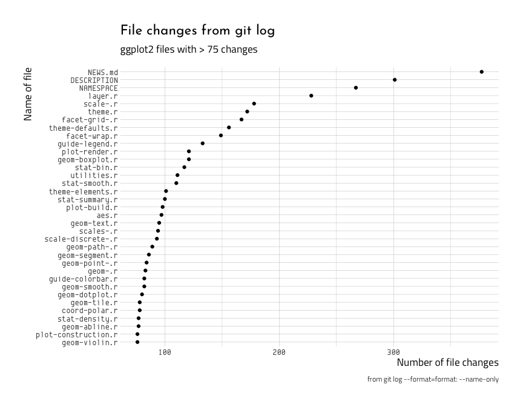
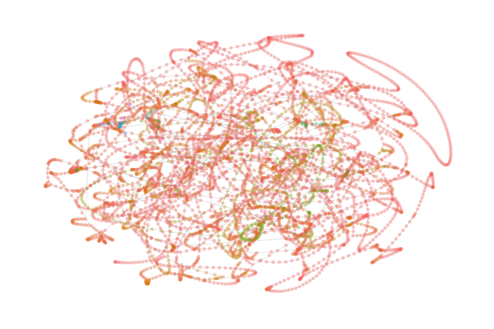

Git log analyses
================
Martin Frigaard
current version: 2020-02-11

# Motivation

The `git-logs` repo has a variety of analyses of git data. Most of these
use the command line (`bash`), others use the `gh` package in R.

    #>  .
    #>  ├── 01.0-git-file-changes-R.Rmd
    #>  ├── 01.0-git-file-changes-R.md
    #>  ├── 02.0-git-author-data-R.Rmd
    #>  ├── 02.0-git-author-data-R.md
    #>  ├── 03.1-tidy-git-analysis-jackson.Rmd
    #>  ├── 03.1-tidy-git-analysis-jackson.md
    #>  ├── 03.2-gh-purrr-package-byran.Rmd
    #>  ├── CHANGELOG.md
    #>  ├── CITATION
    #>  ├── EXAMPLES.md
    #>  ├── LICENSE
    #>  ├── README.Rmd
    #>  ├── README.md
    #>  ├── code
    #>  ├── data
    #>  ├── doc
    #>  ├── docs
    #>  ├── downloads
    #>  ├── figs
    #>  ├── git-logs.Rproj
    #>  ├── helpers.md
    #>  ├── requirements.txt
    #>  └── results

## Git log analyses

1.  [git file
    changes](https://github.com/mjfrigaard/code-forensics/blob/master/git-logs/01.0-git-file-changes-R.md)

2.  [git author
    data](https://github.com/mjfrigaard/code-forensics/blob/master/git-logs/02.0-git-author-data-R.md)

3.  [git analysis by simon
    jackson](https://github.com/mjfrigaard/code-forensics/blob/master/git-logs/03.1-tidy-git-analysis-jackson.md)
    - not sure if adds anything, but makes some pretty pictures

